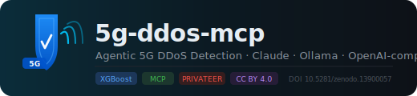

<p align="center">
  
</p>

<p align="center">
  <b>Model Context Protocol server for real-time 5G DDoS detection and response</b><br/>
  Powered by the <a href="https://doi.org/10.5281/zenodo.13900057">NCSRD-DS-5GDDoS dataset</a> — a physical 3GPP-compliant 5G testbed from the EU Horizon PRIVATEER project
</p>

<p align="center">
  
  
  
  
  
  
</p>

---

## What It Does

Gives any LLM agent the ability to detect, explain, and respond to 5G DDoS attacks:

| Tool | What it does |
|------|-------------|
| `detect_anomaly` | Classify live 5G telemetry as benign/attack — returns type, confidence, severity |
| `explain_attack` | Generate a natural-language incident report via the configured LLM |
| `recommend_response` | Slice-aware mitigation plan with generic REST API call examples |
| `query_history` | Search past incidents + dataset reference patterns for few-shot LLM reasoning |

Supports **SYN, UDP, ICMP, DNS, and GTP-U flooding** (the last being 5G-specific, critical severity).

---

## Quick Start

Pick your LLM backend and follow the matching path. The server runs in **demo mode** (rule-based heuristics) without a trained model, so you can try all tools immediately.

---

### Option A — Claude (Anthropic API)

> Best output quality for incident reports and recommendations.

```bash
# 1. Clone and install
git clone https://github.com/ncsrd/5g-ddos-mcp
cd 5g-ddos-mcp
pip install -r requirements.txt

# 2. Configure
cp .env.example .env
#    Set: LLM_BACKEND=claude
#    Set: ANTHROPIC_API_KEY=sk-ant-...

# 3. Run
python -m src.server
```

Connect in `claude_desktop_config.json`:
```json
{
  "mcpServers": {
    "5g-ddos": {
      "command": "python",
      "args": ["-m", "src.server"],
      "cwd": "/path/to/5g-ddos-mcp",
      "env": {
        "LLM_BACKEND": "claude",
        "ANTHROPIC_API_KEY": "sk-ant-..."
      }
    }
  }
}
```

---

### Option B — Ollama (local open-source LLMs, fully offline)

> Best for air-gapped or privacy-sensitive deployments. No data leaves your machine.

**Step 1 — Install Ollama**

```bash
# macOS / Linux
curl -fsSL https://ollama.com/install.sh | sh

# Windows: download from https://ollama.com/download
```

**Step 2 — Pull a model**

```bash
ollama pull llama3.2       # 3B (fast) or 8B (balanced) — recommended default
ollama pull mistral        # 7B — strong reasoning
ollama pull phi4           # 14B — best structured output
ollama pull gemma3         # Google Gemma 3, 4B–27B
ollama pull deepseek-r1    # 8B chain-of-thought distill
ollama pull qwen2.5        # 7B / 14B / 72B
```

**Step 3 — Run the MCP server**

```bash
cp .env.example .env
#    Set: LLM_BACKEND=ollama
#    Set: OLLAMA_MODEL=llama3.2   (or whichever you pulled)
#    OLLAMA_BASE_URL defaults to http://localhost:11434

python -m src.server
```

Connect in `claude_desktop_config.json`:
```json
{
  "mcpServers": {
    "5g-ddos": {
      "command": "python",
      "args": ["-m", "src.server"],
      "cwd": "/path/to/5g-ddos-mcp",
      "env": {
        "LLM_BACKEND": "ollama",
        "OLLAMA_MODEL": "llama3.2"
      }
    }
  }
}
```

---

### Option C — OpenAI-compatible endpoint

> Works with vLLM, LM Studio, Groq, Together.ai, Mistral API, Perplexity, and any other OpenAI-compatible provider.

```bash
cp .env.example .env
#    Set: LLM_BACKEND=openai_compatible
#    Set: OPENAI_BASE_URL=<your endpoint>
#    Set: OPENAI_MODEL=<model name>
#    Set: OPENAI_API_KEY=<your key>

python -m src.server
```

**Provider examples:**

| Provider | `OPENAI_BASE_URL` | `OPENAI_MODEL` |
|----------|-------------------|----------------|
| **vLLM** (self-hosted) | `http://localhost:8080/v1` | your deployed model |
| **LM Studio** (local) | `http://localhost:1234/v1` | model loaded in LM Studio |
| **Groq** | `https://api.groq.com/openai/v1` | `llama-3.3-70b-versatile` |
| **Together.ai** | `https://api.together.xyz/v1` | `meta-llama/Llama-3-70b-chat-hf` |
| **Mistral API** | `https://api.mistral.ai/v1` | `mistral-large-latest` |
| **Perplexity** | `https://api.perplexity.ai` | `llama-3.1-sonar-large-128k-online` |
| **OpenAI** | `https://api.openai.com/v1` | `gpt-4o` |

---

### Option D — Docker (any backend)

```bash
# Build
docker build -t 5g-ddos-mcp .

# Run with Claude
docker run --env-file .env -p 8000:8000 \
  -v $(pwd)/models:/app/models:ro \
  -v $(pwd)/data:/app/data:ro \
  5g-ddos-mcp

# Run with Ollama (Ollama running on host)
docker run -p 8000:8000 \
  -e LLM_BACKEND=ollama \
  -e OLLAMA_BASE_URL=http://host.docker.internal:11434 \
  -e OLLAMA_MODEL=llama3.2 \
  5g-ddos-mcp

# Full stack: MCP server + Ollama side-by-side
docker compose --profile with-ollama up
# Then pull a model inside the Ollama container:
docker exec -it ollama ollama pull llama3.2

# Full stack with InfluxDB + Grafana (mirrors the NCSRD testbed pipeline)
docker compose --profile full up
```

---

### Option E — Kubernetes

```bash
# 1. Apply namespace, storage, and config
kubectl apply -f k8s/namespace.yaml
kubectl apply -f k8s/pvc.yaml
kubectl apply -f k8s/configmap.yaml

# 2. Create secrets (replace with real values)
kubectl create secret generic 5g-ddos-mcp-secrets \
  --from-literal=ANTHROPIC_API_KEY=sk-ant-... \
  -n 5g-ddos-mcp

# 3. Deploy (set LLM_BACKEND in k8s/deployment.yaml before applying)
kubectl apply -f k8s/deployment.yaml
kubectl apply -f k8s/service.yaml

# 4. Train the model inside the cluster (after populating the data PVC)
kubectl apply -f k8s/train-job.yaml
kubectl logs -f job/train-classifier -n 5g-ddos-mcp

# 5. Check status
kubectl get pods -n 5g-ddos-mcp
```

To deploy Ollama as a sidecar for a fully self-contained cluster:
```bash
# Ollama deployment + service are already included in k8s/deployment.yaml
# Set LLM_BACKEND=ollama and OLLAMA_BASE_URL=http://ollama-service:11434 in configmap.yaml
kubectl apply -f k8s/deployment.yaml   # deploys both mcp-server and ollama
kubectl apply -f k8s/service.yaml
# Then exec into the Ollama pod to pull a model:
kubectl exec -it deploy/ollama -n 5g-ddos-mcp -- ollama pull llama3.2
```

---

## Dataset Setup

The ML model requires the **NCSRD-DS-5GDDoS v3.0** dataset (~620 MB), which must be downloaded separately. The server runs in heuristic demo mode without it.

```bash
# Automatic download from Zenodo (DOI: 10.5281/zenodo.13900057)
chmod +x scripts/download_dataset.sh
./scripts/download_dataset.sh

# Then train the classifier (~5–15 min depending on hardware)
python scripts/train_model.py

# Quick smoke-test with 100k rows
python scripts/train_model.py --nrows 100000
```

See [`data/DATASET_INSTRUCTIONS.md`](data/DATASET_INSTRUCTIONS.md) for full details on files and manual download.

**Target metrics** (from published results on this dataset):

| Metric | Target | Published |
|--------|--------|-----------|
| Binary F1 | > 0.95 | 0.98 |
| AUC-ROC | > 0.99 | 0.999 |
| Multi-class Weighted F1 | > 0.95 | 0.98 |

---

## Architecture

```
┌──────────────────────────────────────────────┐
│             MCP Client (any LLM)             │
└──────────────────┬───────────────────────────┘
                   │  MCP Protocol (stdio / HTTP)
┌──────────────────▼───────────────────────────┐
│             5G-DDoS MCP Server               │
│                                              │
│  ┌─────────────┐   ┌──────────────────────┐  │
│  │  ML Layer   │   │      LLM Layer       │  │
│  │  XGBoost    │   │  Claude  │  Ollama   │  │
│  │  Classifier │   │  OpenAI-compatible   │  │
│  └──────┬──────┘   └──────────────────────┘  │
│         │                                    │
│  ┌──────▼────────────────────────────────┐   │
│  │              MCP Tools                │   │
│  │  detect_anomaly  │  explain_attack    │   │
│  │  recommend_response  │  query_history │   │
│  └───────────────────────────────────────┘   │
└──────────────────────────────────────────────┘
                   │
        ┌──────────▼──────────┐
        │    NCSRD Dataset    │
        │    (local CSV)      │
        └─────────────────────┘
```

**Tier 1 — Perception:** XGBoost classifier (trained on NCSRD-DS-5GDDoS) detects attacks from real-time telemetry.

**Tier 2 — Reasoning:** LLM produces contextual incident reports and mitigation recommendations.

**Tier 3 — Action:** Generic REST API integration for automated response (blacklist UE, isolate slice, rate-limit). Compatible with Open5GS, free5GC, OAI, or any custom NMS — set `RESPONSE_API_URL` to enable.

---

## Configuration Reference

All settings via environment variables. Copy `.env.example` to `.env` to get started.

| Variable | Default | Description |
|----------|---------|-------------|
| `LLM_BACKEND` | `claude` | `claude` \| `ollama` \| `openai_compatible` |
| `ANTHROPIC_API_KEY` | — | Required when `LLM_BACKEND=claude` |
| `CLAUDE_MODEL` | `claude-sonnet-4-6` | Anthropic model ID |
| `OLLAMA_BASE_URL` | `http://localhost:11434` | Ollama server URL |
| `OLLAMA_MODEL` | `llama3.2` | Any model pulled via `ollama pull` |
| `OPENAI_API_KEY` | — | Required when `LLM_BACKEND=openai_compatible` |
| `OPENAI_BASE_URL` | `https://api.openai.com/v1` | Any OpenAI-compatible endpoint URL |
| `OPENAI_MODEL` | `gpt-4o-mini` | Model name at the endpoint |
| `LLM_MAX_TOKENS` | `2048` | Max tokens for LLM completions |
| `LLM_TEMPERATURE` | `0.3` | Generation temperature |
| `ANOMALY_THRESHOLD` | `0.5` | Attack confidence threshold (0.0–1.0) |
| `RESPONSE_API_URL` | — | Network management API for auto-execute (optional) |
| `RESPONSE_API_KEY` | — | Bearer token for the response API (optional) |
| `MCP_PORT` | `8000` | Server port |
| `LOG_LEVEL` | `INFO` | Logging level |

---

## Dataset

**NCSRD-DS-5GDDoS v3.0** — [DOI: 10.5281/zenodo.13900057](https://doi.org/10.5281/zenodo.13900057)

| File | Size | Description |
|------|------|-------------|
| `amari_ue_data_merged_with_attack_number.csv` | 241.5 MB | **Primary ML file** — labeled, 6 classes |
| `amari_ue_data_classic_tabular.csv` | 143.6 MB | UE metrics, Classic cells |
| `amari_ue_data_mini_tabular.csv` | 87.3 MB | UE metrics, Mini cell |
| `enb_counters_data_classic_tabular.csv` | 72.2 MB | Cell-level eNB counters |
| `enb_counters_data_mini_tabular.csv` | 38.2 MB | Mini cell counters |
| `mme_counters.csv` | 37.1 MB | NAS-layer MME counters |
| `summary_report.xlsx` | 18.0 kB | Attack summary per UE |

Attack labels (`attack_number` column): `0` benign · `1` SYN flood · `2` UDP flood · `3` ICMP flood · `4` DNS flood · `5` GTP-U flood

---

## Project Alignment

| EU Project | Integration |
|------------|-------------|
| **PRIVATEER** | Dataset provenance; tools serve as WP deliverables |
| **OASEES** | Federated learning partition by cell; edge node deployment via K8s |
| **Q-NEXUS/Q-VERSE** | Slice threat profiling applicable to quantum-network slices |

---

## Citation

```bibtex
@dataset{ncsrd_5gddos_2024,
  title     = {NCSRD-DS-5GDDoS: 5G Radio & Core Metrics -- DDoS Attack Dataset},
  author    = {NCSRD and Space Hellas},
  year      = {2024},
  doi       = {10.5281/zenodo.13900057},
  publisher = {Zenodo},
  license   = {CC BY 4.0},
  note      = {EU Horizon PRIVATEER project, Grant 101096110}
}
```

---

## License

MCP server code: MIT. Dataset: CC BY 4.0 (cite the DOI above).
